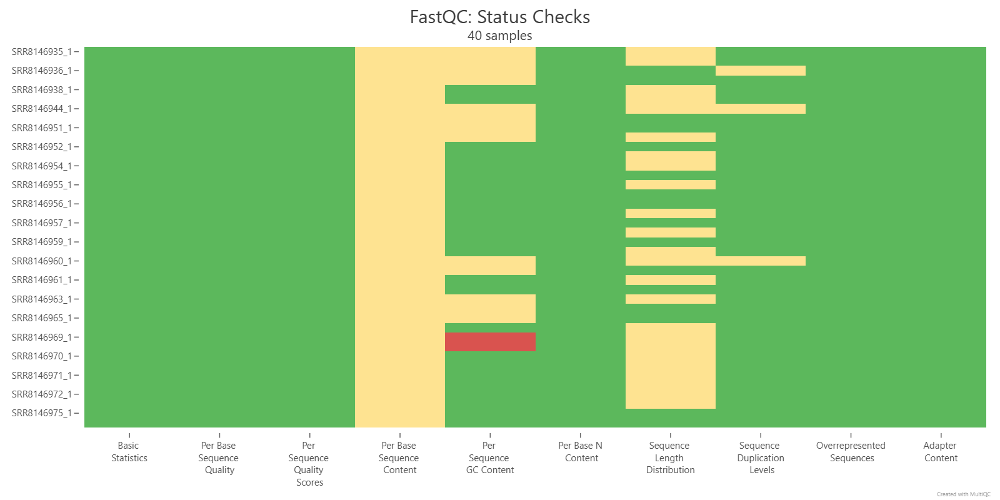
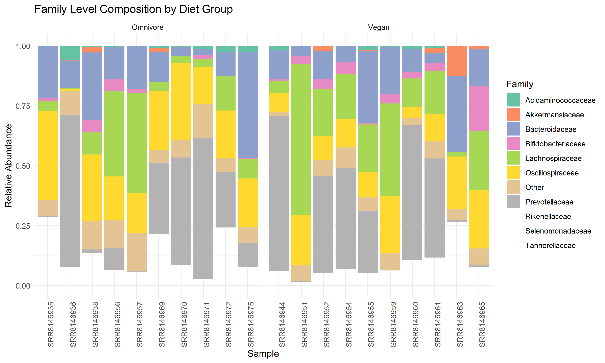
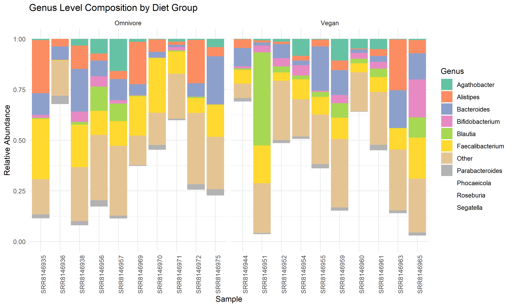
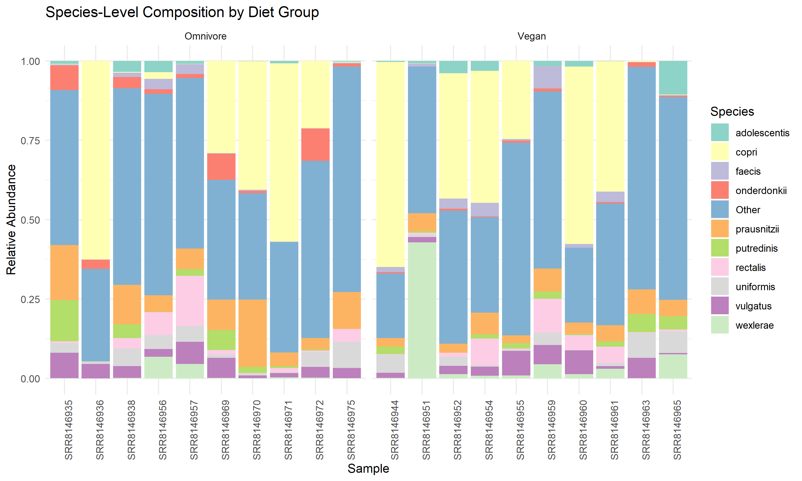
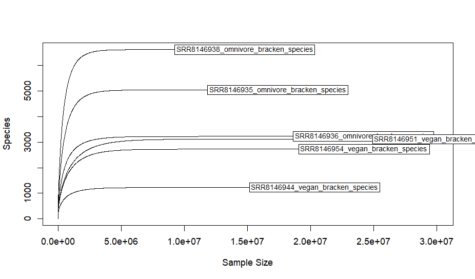
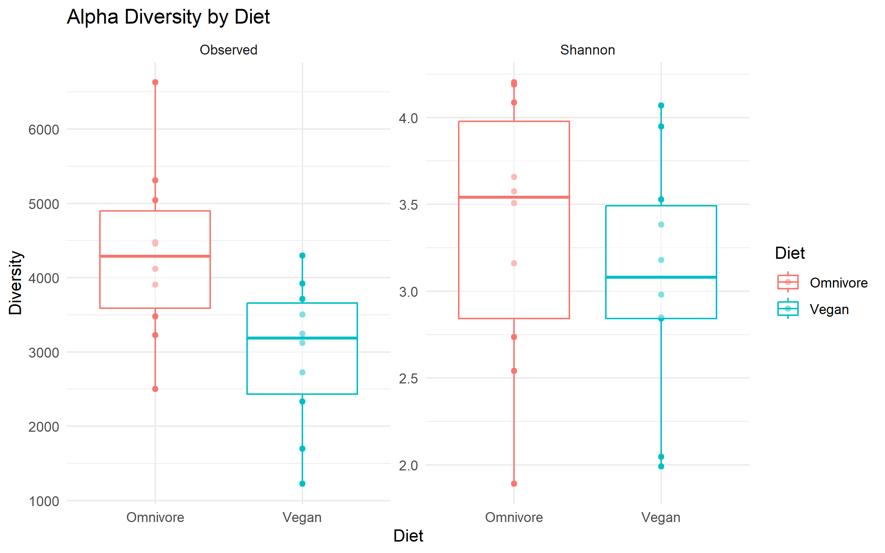
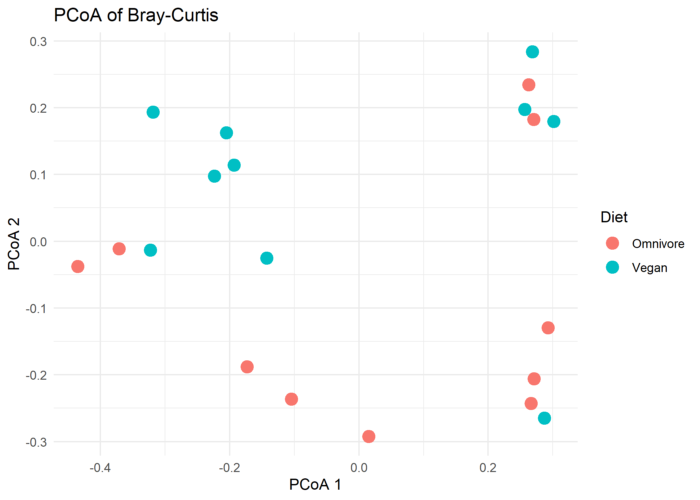
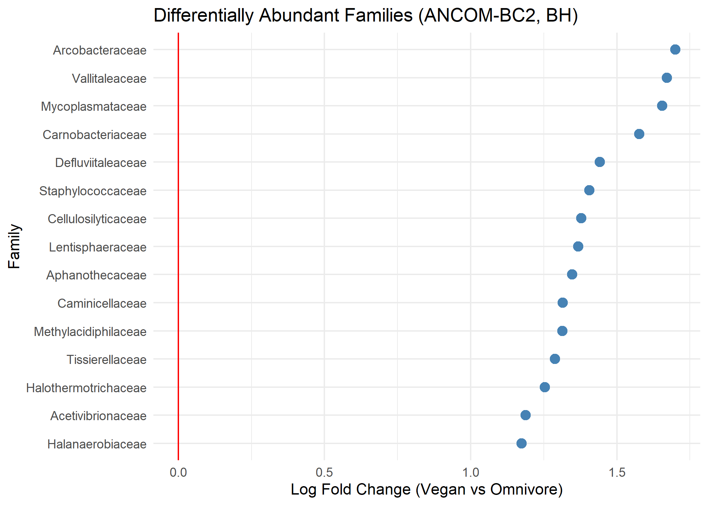
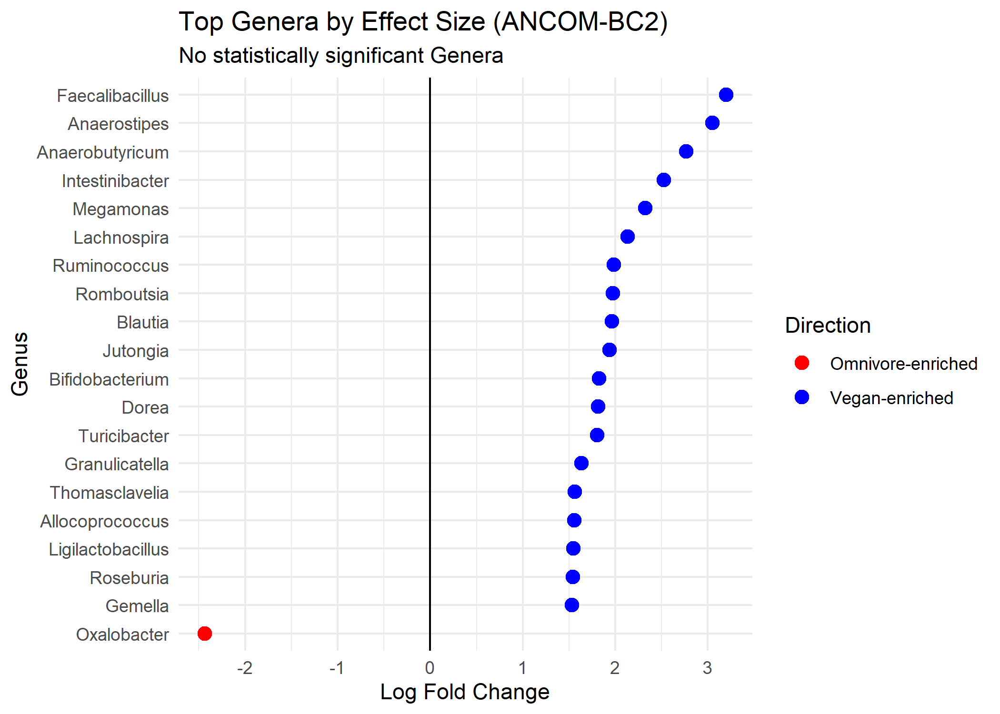

# Shotgun Metagenomic Analysis of Gut Microbiomes in Vegans and Omnivores

## Introduction 
In recent years, the human gut microbiome has been a growing point of conversation due to the high genomic diversity [1]. The current analysis will be based on research by De Filippis et al., who investigated whether specific _Prevotella copri_ strains were associated with specific diets [1]. Their results found that those with high-fiber vegan diets had specific strains present that play a role in carbohydrate catabolism [1]. Whereas subjects on an omnivorous diet showed greater expression of the leuB gene, which contributes to the pathway of branched-chain amino acid biosynthesis [1]. Overall, these initial findings suggest a correlation between dietary patterns and the composition of the gut microbiome, underscoring the importance of this field of study. Specifically, this comparison is important because of the potential implications when evaluating Western and non-Western dietary patterns. These populations typically differ in macronutrient intake: Western diets are generally higher in protein and fat, while non-Western diets are often higher in dietary fiber. To further evaluate these differences, shotgun metagenomic analysis will be used to examine microbial diversity within the gut microbiomes of three vegans and three omnivores. This analysis will include measures of alpha diversity, beta diversity, and differential abundance to compare microbial communities between the two dietary groups.

### Design Rationale 
For this analysis, gut microbiome data will be taken from the study by De Filippis et al., using datasets from ten vegans and ten omnivores. Each sample contains DNA from millions of microorganisms, and this analysis will focus on identifying the presence of _Prevotella copri_ strains across the different dietary groups [1]. The sequencing data will be obtained from the NCBI Sequence Read Archive (SRA), and the `SRA Toolkit` will be used in the Linux terminal to download and process the raw sequencing files.

Before analysis, the sequencing reads will first be checked for quality using `FastQC` [2]. This program provides information about sequencing quality, GC content, and possible adapter contamination. The `FastQC` results will then be aggregated and summarized using `MultiQC` [3], allowing for efficient comparison across all samples. These results help determine whether trimming is needed and guide how the trimming should be performed. If necessary, reads will be trimmed using `fastp` [4] to remove low-quality bases and adapter sequences. Host DNA contamination has already been performed on the SRR NCBI datasets for all samples.

Taxonomic classification will then be used to identify which microorganisms are present in the metagenomic samples. Several types of tools can be used for this step, including DNA-based classifiers such as `Kraken2` and `Centrifuge`, protein-based classifiers such as `Kaiju`, and marker-based methods such as `MetaPhlAn2` [5]. In the original study used for this analysis, De Filippis et al. performed taxonomic profiling using the marker-based tool `MetaPhlAn2` [1]. However, benchmarking studies have shown that DNA-based classifiers generally perform well for whole-genome metagenomic datasets [5]. Because tool performance can vary depending on factors such as database choice, computational resources, and dataset type, careful tool selection is important when designing a metagenomic analysis pipeline [6].

For this analysis, `Kraken2` was selected because it is fast and uses memory efficiently to classify reads based on k-mers [7] and performs well on large shotgun metagenomic datasets [5]. One limitation of `Kraken2` is that some reads cannot be assigned unambiguously at the species level because closely related organisms may share nearly identical DNA sequences. In these cases, reads are assigned to higher taxonomic levels such as genus or family. To address this, `Bracken` will be used after `Kraken2` to improve abundance estimation. `Bracken` redistributes reads assigned to higher taxonomic levels to more specific taxa, allowing more accurate species- and genus-level abundance estimates from metagenomic datasets [8].

Following taxonomic classification and abundance estimation, microbial community diversity will be analyzed to compare the gut microbiomes of the vegan and omnivore groups. These analyses will be performed in `R` using the `phyloseq` package, which provides a framework for organizing and analyzing microbiome data and integrates with commonly used packages such as `vegan` and `ggplot2` for ecological analysis and visualization [9]. Alpha diversity metrics will be calculated to measure diversity within each sample, while beta diversity will be used to compare microbial community composition between groups. Differences between samples will be evaluated using Bray–Curtis dissimilarity, which incorporates taxonomic abundance information and has been shown to be a sensitive metric for detecting differences between microbial communities [10].

The last step is the differential abundance analysis, which will identify taxa that differ significantly between the vegan and omnivore samples. Differential abundance testing is a central component of microbiome analysis. However, in microbiome datasets, only relative abundances of taxa are observed, which makes it challenging to identify truly differential taxa [10]. Due to this, `ANCOM-BC` (Analysis of Compositions of Microbiomes with Bias Correction) will be used for differential abundance, which was specifically developed to account for compositional bias in microbiome sequencing data. Methods originally developed for RNA-seq analysis, such as `DESeq2` and `edgeR`, have been shown to perform poorly on microbiome taxonomic profiles, except for limma, due to differences in the statistical properties of the data [11]. In contrast, methods such as `ANCOM` and `ANCOM-BC` better control false discovery rates when identifying differential taxa in microbiome datasets [12]. Therefore, `ANCOM-BC` was selected to identify taxa whose abundance differs significantly between the vegan and omnivore groups in this study.

## Methods
The metagenomics analysis was conducted using the _Digital Research Alliance of Canada Nibi Cluster_ (compute nodes and SLURM jobs) and `RStudio`. All software and modules on the cluster were run through `Docker` container images executed with `Apptainer`, ensuring a consistent and reproducible environment. The workflow is outlined below, with all associated scripts available in the [`scripts`](scripts/) directory. All .sh scripts were executed on the Nibi scratch environment, while downstream analysis in `RStudio` was performed outside of the cluster.

### 1.0 - Data Acquisition & Software Setup 
#### 1.1 - Nibi Cluster Containers
To ensure reproducibility and maintain consistent software versions, all command-line tools were executed within containerized environments. `Apptainer` was used to retrieve pre-built `Docker` images and convert them into `.sif` container files, which were organized within a dedicated `containers/` directory. The process of building these containers was automated using the [`00_buildcontainers.sh`](scripts/00_buildcontainers.sh) script, which includes version numbers.

#### 1.2 - R Environment Setup 
Data analysis was performed in `R` version 4.5.1. All necessary `CRAN` and `Bioconductor` dependencies, including their respective versions, can be installed using the [`00_packages.R`](scripts/00_packages.R) script included in this repository.

#### 1.3 - Data Acquisition 
The data used in this analysis were obtained from the NCBI Sequence Read Archive (SRA) and are derived from the study by De Filippis et al. [1]. The dataset includes multiple samples from individuals following either a vegan or an omnivore diet.

* **Vegan Samples** - SRR8146944, SRR8146951, SRR8146954, SRR8146952, SRR8146955, SRR8146959, SRR8146960, SRR8146961, SRR8146963, and SRR8146965  
* **Omnivore Samples** - SRR8146935, SRR8146936, SRR8146938, SRR8146956, SRR8146957, SRR8146969, SRR8146970, SRR8146971, SRR8146972, and SRR8146975  
  
Raw SRA files were obtained using the `prefetch` command from the `SRA Toolkit` (v3.2.1) container, as outlined in [`01_data.sh`](scripts/01_data.sh). The downloaded samples were then validated to ensure complete retrieval in [`02_data.sh`](scripts/02_data.sh). Conversion to `FASTQ` format was subsequently performed using `fasterq-dump` in [`03_data.sh`](scripts/03_data.sh). The resulting FASTQ files were then compressed using `pigz`, enabling parallel compression to reduce computational time. 

### 2.0 - Quality Control & Trimming 
#### 2.1 - Quality Control with FastQC
Raw sequencing reads were assessed using `FastQC` version 0.11.0 to evaluate quality metrics, including per-base quality scores, GC content, and potential adapter contamination, prior to downstream analysis. This included the ten vegan and omnivore samples. `FastQC` was run in an `Apptainer` container for reproducibility, with samples processed separately for vegan and omnivore groups and reports generated in HTML format. The script used for this step can be found at [`04_fastqc.sh`](scripts/04_fastqc.sh) and was run on a compute node using `salloc` with 16 CPUs and 120 GB of memory (These compute node parameters were used throughout the following steps). 

#### 2.2 - Quality Control with MultiQC
The quality control reports generated in the previous step by `FastQC` were aggregated using `MultiQC` v1.33 to provide a unified overview of sequencing quality across all samples. This step allows for efficient comparison of quality metrics between vegan and omnivore groups. `MultiQC` was executed within an `Apptainer` container to ensure reproducibility, and a single HTML report was generated summarizing all FastQC outputs. The script used for this step can be found at [`05_multiqc.sh`](scripts/05_multiqc.sh). 

#### 2.3 - Trimming with fastp
The results from the `MultiQC` indicated that light filtering would be beneficial. Therefore, the paired-end reads were quality filtered and trimmed using `fastp` v0.23.4 [4, 13]. Trimming parameters were selected based on the results of the initial `FastQC` analysis, with low-quality bases (Phred score < 20, `-q 20`) and short reads (< 50 bp, `-l 50`) removed to improve downstream analysis quality. A Phred score cutoff of 20 was used, which corresponds to about 99% base-calling accuracy and is commonly used to remove low-quality bases while keeping most of the data. Reads shorter than 50 bp were also removed, since shorter sequences are less reliable for alignment and can lead to less accurate taxonomic classification in metagenomic analysis. Trimming was performed within an `Apptainer` container for reproducibility, with samples processed separately for vegan and omnivore groups using parallel threads. Both HTML and JSON reports were generated for each sample to assess trimming performance. The script used for this step can be found at [`06_fastp.sh`](scripts/06_fastp.sh).

### 3.0 - Taxonomic Classification with Kraken2 
An initial evaluation was performed using the 16 GB `Kraken2` database on a subset of samples (3 vegan and 3 omnivore) across confidence thresholds of 0.05 and 0.10. Based on these results, the standard full `Kraken2` database was selected for final taxonomic classification. The final analysis was conducted using all 10 vegan and 10 omnivore samples to improve classification accuracy and taxonomic resolution. Database download and setup steps can be found in [`00_kraken_databases.sh`](scripts/00_kraken_databases.sh) [14].

#### 3.1 - Standard Full Database, conf = 0.15
Taxonomic classification was performed using `Kraken2` v2.1.7 with the standard full database [6, 14]. Trimmed paired-end reads were classified using a confidence threshold of 0.15. This decision was made from initial testing and from prior studies showing that moderate thresholds improve classification accuracy while avoiding the substantial loss of classified reads observed at higher thresholds [15]. `Kraken2` was executed within an `Apptainer` container as a batch job on the Nibi DRAC cluster, utilizing 16 threads and 120 GB of memory. The `--quick` option was enabled to lower the runtime. Separate classification reports and output files were generated for each sample across the vegan and omnivore groups. The script used for this step can be found at [`07_krakenall.sh.`](scripts/07_krakenall.sh).

### 4.0 - Bracken for Normalization 
Abundance estimation was performed using Bracken [8], which re-estimates species-level abundances from `Kraken2` classification reports by accounting for k-mer distribution biases. This step improves the accuracy of taxonomic quantification for downstream analysis. `Bracken` version 3.1 was executed within an `Apptainer` container on a compute node using srun (16 CPUs, 120 GB memory, 2-hour runtime). All Kraken2 reports were processed at the species level (`-l S`) with a read length of 150 bp, and a threshold of 10 reads was applied to reduce low-abundance noise. The script used for this step can be found at [`08_bracken.sh`](scripts/08_bracken.sh). 

#### 4.1 - Bracken BIOM table 
`Bracken` output reports were converted into a BIOM-format table using `kraken-biom` v1.0.1 to facilitate downstream analysis in `R` [16]. The BIOM table was generated in JSON format due to compatibility issues with HDF5-based BIOM files in `R`. This step was executed within an `Apptainer` container, combining all sample-level (kraken2, braken-normalized species) reports into a single table for downstream and statistical analyses. The script used for this step can be found at [`09_biom.sh`](scripts/09_biom.sh).

### 5.0 - Downstream Analysis in RStudio
The metagenomic analysis was performed in `RStudio` using [`table_full_0.15.biom`](table_full_0.15.biom) generated in the previous step. The data were imported and processed using packages including `phyloseq`, `vegan`, and `ggplot2`, with low-abundance taxa (total counts ≤ 10) filtered to reduce noise. Microbial community composition was explored using relative abundance visualizations at both the phylum and species levels after normalization to proportions. Alpha diversity (Observed richness and Shannon index) was assessed and compared between diet groups using Wilcoxon tests, while beta diversity was evaluated using Bray–Curtis dissimilarity, `PERMANOVA`, and PCoA ordination.

Differential abundance analysis was conducted using `ANCOM-BC2` [17] at both family and genus levels, applying multiple testing correction (Benjamini–Hochberg). `ANCOM-BC2` parameters were selected to balance sensitivity and false discovery control, including a prevalence cutoff of 20% (`prv_cut = 0.20`) to retain consistently observed taxa, and a library size cutoff of 1000 (`lib_cut = 1000`) to exclude low-depth samples. Multiple testing correction was performed using the Benjamini–Hochberg method, which controls the false discovery rate and is less conservative than methods like Holm, allowing more taxa to be detected while still limiting false positives [17]. Structural zero detection and pseudo-sensitivity correction were used to improve results in sparse microbiome data. [17]. The script used for this step can be found at [`10_metanalysis.sh`](scripts/10_metanalysis.sh).

## Results

### Quality Control Results from MultiQC

 
<b>Figure 1. MultiQC summary of FastQC results.</b> FastQC status check heatmap (MultiQC) summarizing quality control metrics across 40 samples (10 vegan and 10 omnivore samples, paired-end). Each row represents an individual sample, and each column corresponds to a FastQC module. Green indicates passing metrics, yellow indicates warnings, and red indicates failures. Most samples passed key quality metrics, with occasional warnings observed in per-base sequence content and sequence length distribution, and a single failure was detected in per-sequence GC content.

 

The overall quality of the reads supported the use of only light trimming. Based on this, conservative filtering parameters were applied with `fastp` (-q 20, -l 50) to remove low-quality bases and very short reads, while retaining the majority of high-quality data for downstream analysis.

### Taxonomic Classification Results

<b>Table 1.</b> Summary of Kraken2 classification results across vegan and omnivore samples, showing the number of samples and the range and average proportion of reads classified in each group.

| Group     | Samples (n) | Mean Classified (%) | Range (%)        |
|-----------|------------|---------------------|------------------|
| Vegan     | 10         | ~63.5               | 59.07 – 77.05    |
| Omnivore  | 10         | ~48.0               | 33.03 – 64.03    |

 

The full `Kraken2` output logs can be found in [`kraken2_full_10632220.err`](kraken2_full_10632220.err) and [`kraken2_full_10632220.out`](kraken2_full_10632220.out). Overall, vegan samples showed consistently higher classification rates compared to omnivore samples. This suggests that a larger proportion of reads in the vegan group matched reference sequences in the database, while the higher proportion of unclassified reads in omnivore samples may reflect greater microbial diversity or the presence of taxa not well represented in the reference database.

As mentioned in the methods, `Bracken` was used to refine `Kraken2` classifications by re-estimating species and genus-level abundances, correcting for biases associated with shared k-mers, and improving the accuracy of taxonomic profiles. The resulting `Bracken` outputs were then converted into BIOM format using `kraken-biom`, generating a structured feature table suitable for downstream analysis. This BIOM table was imported into `R`, where further processing, normalization, and visualization were performed using packages such as `phyloseq` and `ggplot2`. All subsequent analyses and figures were generated in R to ensure consistent and reproducible exploration of gut microbial composition in vegan and omnivore samples.

### Family Level Abundance in R

 
<b>Figure 2. Taxonomic composition by diet group at the family level.</b> Relative abundance of microbial taxa at the family level across all samples, grouped by diet (omnivore and vegan). Each bar represents an individual sample, with colors indicating the proportion of different families. The gut microbiome in both groups is largely dominated by families such as <i>Bacteroidaceae</i>, <i>Lachnospiraceae</i>, and <i>Oscillospiraceae</i>. Lower-abundance families were grouped into an "Other" category for clarity. Overall, the taxonomic profiles appear broadly similar between diet groups, though some variation in the relative abundance of key families can be observed across samples.

### Genus Level Abundance in R

 
<b>Figure 3. Taxonomic composition by diet group at the genus level.</b> Relative abundance of microbial taxa at the genus level across all samples, grouped by diet (omnivore and vegan). Each bar represents an individual sample, with colors indicating the proportion of different genera. The gut microbiome is dominated by genera such as <i>Bacteroides</i>, <i>Faecalibacterium</i>, <i>Blautia</i>, and <i>Alistipes</i>, with noticeable variability across samples. Lower-abundance genera were grouped into an "Other" category for clarity. While overall genus-level composition appears broadly similar between diet groups, variation in the relative abundance of specific genera suggests potential diet-associated differences.

 
While Figures 2 and 3 show high-level trends, these compositions were further examined at the species level for more detailed analysis.

 
 

 
<b>Figure 4. Species-level taxonomic composition by diet group.</b> Relative abundance of microbial taxa at the species level across all vegan and omnivore samples. Each bar represents an individual sample, with colors indicating the proportion of different species. To improve clarity, only the most abundant species are shown individually, while low-abundance species are grouped into an "Other" category. 

 

It can be seen that _Prevotella copri_ observed in Figure 4 is of particular interest due to its association with diet. It appears more abundant in several vegan samples, consistent with its link to fiber-rich diets [1], while showing lower or more variable abundance in omnivore samples.

### Rarecurves for Vegan and Omnivore Samples
 

 
<b>Figure 5. Rarefaction curves for vegan and omnivore samples.</b> Rarefaction analysis showing species richness as a function of sequencing depth for each sample, grouped by diet. Each curve represents an individual sample, with vegan samples shown in green and omnivore samples in orange. 

 
This rarefaction analysis, seen in Figure 5, serves as an initial exploratory step to assess sequencing depth (sample size) and species richness across samples. The general plateauing of curves suggests that the data are adequate for differential abundance analyses.

### Alpha Diversity Analysis

 
<b>Figure 6. Alpha diversity comparison between diet groups.</b> Alpha diversity metrics comparing omnivore and vegan samples using observed species richness (left) and Shannon diversity index (right). Boxplots summarize the distribution of diversity values within each group, with individual points representing samples. Observed richness reflects the total number of detected species, while the Shannon index accounts for both richness and evenness of species distribution. 

 
Overall, the results shown in Figure 6 indicate that omnivore samples tend to have higher diversity, especially in terms of the number of species. Differences in Shannon diversity are smaller but still suggest slightly more even, diverse microbial communities in omnivore samples. Statistical testing using the Wilcoxon rank-sum test found a significant difference in observed richness (p = 0.0185), but not in Shannon diversity (p = 0.393). This suggests that while there may be a difference in species counts, the overall evidence for differences in diversity between groups is limited.

### Beta Diversity Analysis

 
<b>Figure 7. Beta diversity (PCoA) of Bray–Curtis distances.</b> Principal coordinates analysis (PCoA) plot based on Bray–Curtis dissimilarity, showing differences in microbial community composition between omnivore and vegan samples. Each point represents a sample, colored by diet group. Samples that are closer together have more similar microbial communities, while those further apart are more different.

 

The beta diversity analysis in Figure 7 shows some separation by diet, although there is still overlap between groups. This suggests that while diet may influence gut microbial composition, there is also variability within each group. PERMANOVA testing was not statistically significant (p = 0.232), indicating that these differences are not strong. More samples would likely be needed to better detect any consistent patterns between groups.

### Differential Abundance Analysis - Vegan and Omnivore
#### ANCOM-BC2 Family Level

 
<b>Figure 8. Differentially abundant microbial families (ANCOM-BC2).</b> Differential abundance analysis at the family level comparing vegan and omnivore samples using ANCOM-BC2 with Benjamini–Hochberg correction. Each point represents a microbial family, with the x-axis showing the log fold change (vegan vs omnivore). Positive values indicate higher abundance in vegan samples. All displayed families were statistically significant, indicating meaningful differences in abundance between diet groups.

 
Figure 8 shows that all identified families exhibit positive log2 fold-change values, indicating greater abundance in vegan samples than in omnivore samples. Because these differences are also statistically significant, this could suggest that the observed increases are unlikely to be due to random variation and may be associated with dietary differences. To further investigate this, the next step examines genus-level differential abundance to see whether the pattern still holds. 

#### ANCOM-BC2 Genus Level

 
<b>Figure 9. Top differentially abundant genera by effect size.</b> Differential abundance results at the genus level showing the top taxa ranked by log2 fold change between vegan and omnivore samples. Each point represents a genus, with positive values indicating higher abundance in vegan samples (blue) and negative values indicating higher abundance in omnivore samples (red). These results are based solely on effect size, as no genera were statistically significant.

 
Figure 9 highlights trends based solely on log2 fold change values, as no genera were significant. While these differences suggest potential shifts in abundance across diet groups, they should be interpreted with caution, as they are not statistically significant. The differences between the family- and genus-level results are likely due to the higher detail and variability at the genus level. At the family level, multiple genera are grouped together, making it easier to detect overall patterns. When looking at genera separately, the data becomes more variable and harder to find significant differences, especially with a small sample size. Because of this, the results at the family level should be interpreted with caution, as they may not hold at more specific taxonomic levels.

### Discussion

## References
[1] F. De Filippis et al., “Distinct Genetic and Functional Traits of Human Intestinal Prevotella copri Strains Are Associated with Different Habitual Diets,” Cell Host & Microbe, vol. 25, no. 3, pp. 444-453.e3, Mar. 2019, doi: https://doi.org/10.1016/j.chom.2019.01.004.  
[2] s-andrews, “s-andrews/FastQC,” GitHub, Nov. 20, 2018. https://github.com/s-andrews/FastQC  
[3]“MultiQC,” Introduction to RNA-seq using high-performance computing, Nov. 19, 2021. https://hbctraining.github.io/Intro-to-rnaseq-fasrc-salmon-flipped/lessons/11_multiQC.html (accessed Mar. 17, 2026).  
[4] S. Chen, “fastp 1.0: An ultra‐fast all‐round tool for FASTQ data quality control and preprocessing,” iMeta, vol. 4, no. 5, Sep. 2025, doi: https://doi.org/10.1002/imt2.70078.   
[5] L. C. Terrón-Camero, F. Gordillo-González, E. Salas-Espejo, and E. Andrés-León, “Comparison of Metagenomics and Metatranscriptomics Tools: A Guide to Making the Right Choice,” Genes, vol. 13, no. 12, p. 2280, Dec. 2022, doi: https://doi.org/10.3390/genes13122280.  
[6] I. B. Martins, J. M. Silva, and J. R. Almeida, “A systematic review and benchmarking of modern metagenomic tools for taxonomic classification,” Computers in Biology and Medicine, vol. 206, p. 111600, Apr. 2026, doi: https://doi.org/10.1016/j.compbiomed.2026.111600.  
[7] D. E. Wood, J. Lu, and B. Langmead, “Improved metagenomic analysis with Kraken 2,” Genome Biology, vol. 20, no. 1, Nov. 2019, doi: https://doi.org/10.1186/s13059-019-1891-0.   
[8] J. Lu, F. P. Breitwieser, P. Thielen, and S. L. Salzberg, “Bracken: estimating species abundance in metagenomics data,” PeerJ Computer Science, vol. 3, p. e104, Jan. 2017, doi: https://doi.org/10.7717/peerj-cs.104.  
[9] T. Wen, G. Niu, T. Chen, Q. Shen, J. Yuan, and Y. Liu, “The best practice for microbiome analysis using R,” Protein & Cell, vol. 14, no. 10, pp. 713–725, May 2023, doi: https://doi.org/10.1093/procel/pwad024.  
[10] J. G. Kers and E. Saccenti, “The Power of Microbiome Studies: Some Considerations on Which Alpha and Beta Metrics to Use and How to Report Results,” Frontiers in Microbiology, vol. 12, p. 796025, Mar. 2022, doi: https://doi.org/10.3389/fmicb.2021.796025.   
[11] H. Zhou, K. He, J. Chen, and X. Zhang, “LinDA: linear models for differential abundance analysis of microbiome compositional data,” Genome Biology, vol. 23, no. 1, Apr. 2022, doi: https://doi.org/10.1186/s13059-022-02655-5.  
[12] J. Wirbel, M. Essex, S. K. Forslund, and G. Zeller, “A realistic benchmark for differential abundance testing and confounder adjustment in human microbiome studies,” Genome Biology, vol. 25, no. 1, Sep. 2024, doi: https://doi.org/10.1186/s13059-024-03390-9.  
[13] S. Chen, Y. Zhou, Y. Chen, and J. Gu, “fastp: an ultra-fast all-in-one FASTQ preprocessor,” Bioinformatics, vol. 34, no. 17, pp. i884–i890, Sep. 2018, doi: https://doi.org/10.1093/bioinformatics/bty560.  
[14] B. Langmead, “Index zone by BenLangmead,” benlangmead.github.io, Feb. 26, 2026. https://benlangmead.github.io/aws-indexes/k2  
[15] R. J. Wright, A. Comeau, and Morgan, “From defaults to databases: parameter and database choice dramatically impact the performance of metagenomic taxonomic classification tools,” Microbial genomics, vol. 9, no. 3, Mar. 2023, doi: https://doi.org/10.1099/mgen.0.000949.   
[16] S. Dabdoub, “kraken-biom,” GitHub, Sep. 15, 2023. https://github.com/smdabdoub/kraken-biom   
[17] Shyamal Peddada and H. Lin, “Multi-group Analysis of Compositions of Microbiomes with Covariate Adjustments and Repeated Measures,” Research Square (Research Square), May 2023, doi: https://doi.org/10.21203/rs.3.rs-2778207/v1.   
[18] Huang Lin, “ANCOM-BC2 Tutorial,” Bioconductor.org, Oct. 29, 2025. https://bioconductor.org/packages/release/bioc/vignettes/ANCOMBC/inst/doc/ANCOMBC2.html (accessed Mar. 19, 2026).   
